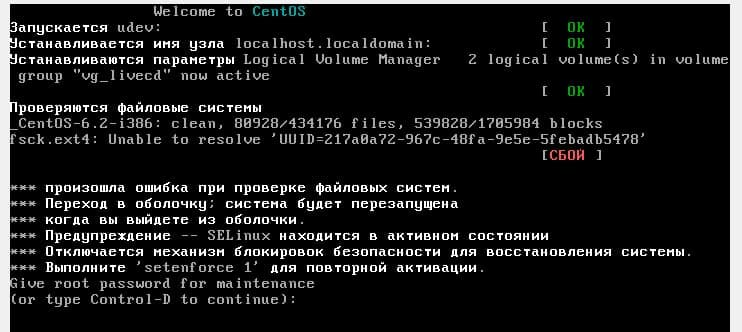
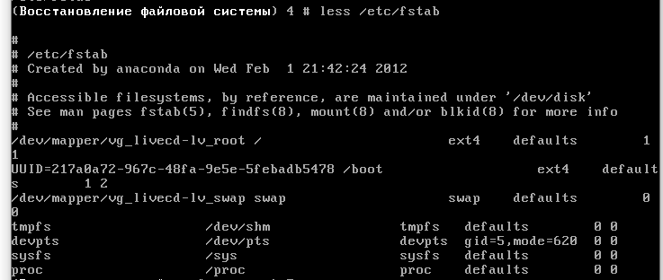
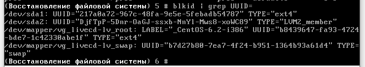
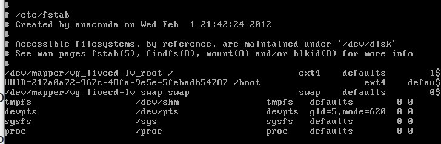

# Лабораторная работа 5
## Что не так
При загрузке операционной системы, получаем ошибку

## Решение проблемы
### Шаг 1
Смторим файл ***/etc/fstab***  
Видим, что проблемный диск с неправильным UUID

### Шаг 2
Смотрим все UUID дисков  
  
Понимаем, что кто-то ввел неправильный UUID, исправляем его
### Шаг 3
Перемонтируем диск для того, что бы была возможность перезаписи  
```shell
mount -o remount,rw /
```
Изменяем UUID
```shell
nano /etc/fstab
```

### Шаг 4
```shell
reboot
```

### Анализ ошибки
В /etc/fstab был введен неправильный uuid раздела, поэтому невозможно было примонтировать раздел при запуске. Исправлено изменением uuid

## ВСЁ УРА
© Ершов Михаил, Блашенков Алесандр, группа M33061
